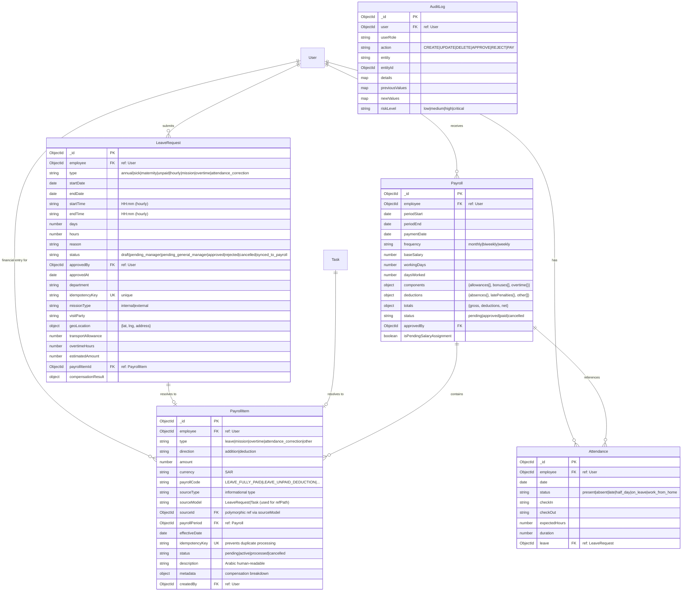

# HRMS Database Schema

## Entity Relationship Diagram



## Indexes

| Table | Index | Fields | Unique |
|-------|-------|--------|--------|
| LeaveRequest | employee_date | employee, startDate | No |
| LeaveRequest | department_status | department, status | No |
| LeaveRequest | idempotencyKey | idempotencyKey | Yes |
| PayrollItem | employee_period | employee, payrollPeriod | No |
| PayrollItem | idempotencyKey | idempotencyKey | Yes |
| PayrollItem | source | sourceType, sourceId | No |
| Payroll | employee_period | employee, periodStart, periodEnd | No |
| AuditLog | user_created | user, createdAt | No |
| AuditLog | entity | entity, entityId | No |

## Key Payroll Codes

| Code | Direction | Description |
|------|-----------|-------------|
| LEAVE_FULLY_PAID | none | Annual, sick, maternity (no financial impact) |
| LEAVE_UNPAID_DEDUCTION | deduction | Unpaid leave (daily_rate × days) |
| LEAVE_HOURLY_DEDUCTION | deduction | Hourly leave within balance (no charge) |
| LEAVE_HOURLY_PARTIAL_UNPAID | deduction | Hourly leave exceeding balance |
| MISSION_INTERNAL_ALLOWANCE | addition | 100 SAR default per internal mission |
| MISSION_EXTERNAL_ALLOWANCE | addition | 200 SAR default per external mission |
| OVERTIME_PAYMENT | addition | hourly_rate × multiplier × hours |
| ATTENDANCE_CORRECTION | none | No direct financial impact |

## Sync Flow

```
LeaveRequest (approved)
  │
  ├── calculateCompensation() → {amount, currency, payrollCode, isDeduction, breakdown}
  │
  ├── syncCompensationToPayroll()
  │     ├── idempotencyKey check (prevents duplicates)
  │     ├── Creates PayrollItem {employee, type, direction, amount, sourceModel, sourceId}
  │     └── Returns PayrollItem
  │
  ├── LeaveRequest.payrollItemId = PayrollItem._id
  │
  └── Attendance.create() for leave days

GET /api/payroll/payslip/current
  ├── Payroll.findOne(employeeId, status in [pending, approved])
  ├── PayrollItem.find(employeeId, status=active)
  ├── PayrollItem grouped by direction (additions/deductions)
  ├── LeaveRequest.checkLeaveBalance(annual, sick)
  └── Returns {payslipNumber, income, deductions, totals, leaveBalances}
```
